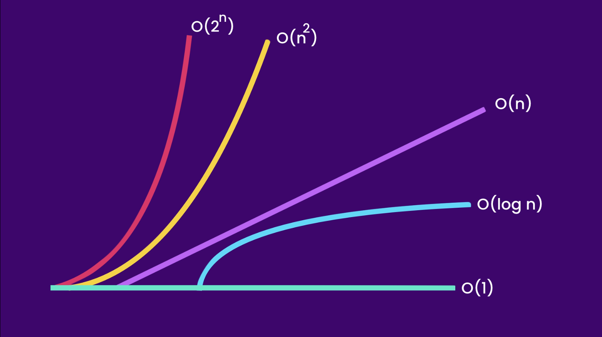

### Big O Notation:

Big O used to describe the performance of the algorithm. It helps to describe that the given algorithm is going to scale
or not.

<br/>

#### `O(1)`:

`O(1)` means that, no matter how much data, it will execute in constant time.

Following function runs in `O(1)` time (or "constant time") relative to its input. The input array could be 1 item or
1,000 items, but this function would still just require one step.

```kotlin
fun log(array: Array<Int>) {
    // the following line will take constant time for execution
    println(numberArray[0]) // O(1)
}
```

<br/>

#### `O(n)`:

`O(n)` means that it is proportional to the amount of data. i.e. if there are 5 items in the input there will be 5
operation, if there are a million items in the input, there will be a million operations.

Following function runs in `O(n)` time (or "linear time"), where n is the number of items in the array. If the array has
10 items, we have to print 10 times. If it has 1000 items, we have to print 1000 times.

```kotlin
fun log(array: Array<Int>) {

    println() // O(1)

    for (number in array) { // O(n)
        println(number)
    }

    println() // O(1)
}
```

<br/>

#### `O(n^2)` or `O(n * n)` or `O(n2)`:

Here we're nesting two loops. If our array has n items, our outer loop runs n times and our inner loop runs n times for
each iteration of the outer loop, giving us n2 total prints. Thus, this function runs in `O(n2)` time (or "quadratic
time")
. If the array has 10 items, we have to print 100 times. If it has 1000 items, we have to print 1000000 times.

```kotlin
fun log(array: Array<Int>) {
    // O(n2)
    for (first in array) { // O(n)
        for (second in array) { // O(n)
            println("$first & $second")
        }
    }
}
```

<br/>

#### `O(2n)`:

An example of an `O(2n)` function is the recursive calculation of Fibonacci numbers. `O(2n)` denotes an algorithm whose
growth doubles with each addition to the input data set. The growth curve of an `O(2n)` function is exponential -
starting off very shallow, then rising meteorically.

```kotlin
fun fibonacci(num: Int): Int {
    return if (num <= 1) num else fibonacci(num - 2) + fibonacci(num - 1)
}
```

<br/>

#### Big O Graph:




<br/>

---

### Arrays:

Arrays are the simplest data structure which is used to store object which contains elements of a similar data type.

Arrays have fixed size and each element gets stored in sequential order.

Arrays use `O(1)` complexity to get its item using index position.

Array can be defined as following:

```kotlin
val numberArray = arrayOf(1, 2, 3, 4)

// OR

val numberArray = IntArray(4)
numberArray[0] = 1
numberArray[1] = 2
numberArray[2] = 3
numberArray[3] = 4
```

> In Java/Kotlin, if you want dynamic growable array, then you can use `Vector` or `ArrayList`.
> In case of `Vector`, it grows by 100% when there is new space required for the item. In case
> of `ArrayList`, it grows by 50% when there is new space required.

#### Runtime complexion for various Arrays methods:

1. Lookup By Index - O(1)
2. Lookup By Value - O(n)
3. Insert - O(n)
4. Delete - O(n)
