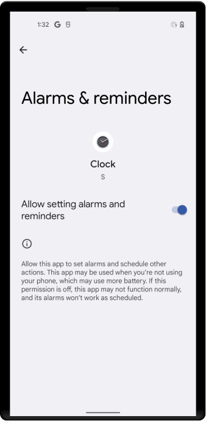

# Alarm Manager:

Alarms (based on the AlarmManager class) give you a way to perform time-based operations outside the lifetime of your
application. For example, you could use an alarm to initiate a long-running operation, such as starting a service once a
day to download a weather forecast.

<br/>

### Exact Alarms:

The system invokes an alarm at an exact time in the future.

We can schedule alarm using following methods:

**`setExact()`**

Triggers an alarm at a nearly precise time in the future, as long as other battery-saving measures aren't in effect.

Use this method to set exact alarms, unless your app's work is time-critical for the user.

`setExactAndAllowWhileIdle()`

Invoke an alarm at a nearly precise time in the future, even if battery-saving measures are in effect.

`setAlarmClock()`

Invoke an alarm at a precise time in the future. Because these alarms are highly visible to users, the system never
adjusts their delivery time. The system identifies these alarms as the most critical ones and leaves low-power modes if
necessary to deliver the alarms.

<br/>

**Declare the exact alarms permission:**

If your app targets Android 12 (API level 31) or higher, you must obtain the "Alarms & reminders" special app access. To
do so, declare the SCHEDULE_EXACT_ALARM permission in your app's manifest file, as shown in the following code snippet:

```xml

<uses-permission android:name="android.permission.SCHEDULE_EXACT_ALARM"/>
```

**Check that your app still has permission:**

Both the user and the system can revoke the "Alarms & reminders" special app access. When the "Alarms & reminders"
special app access is revoked for your app, your app is stopped, and all future exact alarms are canceled.

When the "Alarms & reminders" special app access is granted to your app, the system sends it
the `ACTION_SCHEDULE_EXACT_ALARM_PERMISSION_STATE_CHANGED` broadcast. Your app should implement a broadcast receiver
that does the following:

1. Confirm that your app still has the special app access. To do so, call `canScheduleExactAlarms()`.

2. Reschedule any exact alarms that your app needs, based on its current state. This logic should be similar to what
   your app does when it receives the `ACTION_BOOT_COMPLETED` broadcast.

**Ask users to grant the app access:**

If necessary, you can send users to the **Alarms & reminders** screen in system settings, as shown in the following
image, complete the following steps:

1. In your app's UI, explain to the user why your app needs to schedule exact alarms.

2. Invoke an intent that includes the `ACTION_REQUEST_SCHEDULE_EXACT_ALARM` intent action.




<br/>

**Set a repeating alarm:**

Repeating alarms allow the system to notify your app on a recurring schedule.

A poorly-designed alarm can cause battery drain and put a significant load on servers. For this reason, as of Android
4.4 (API level 19), all repeating alarms are inexact alarms.

```kotlin
class MainActivity : AppCompatActivity() {

    override fun onCreate(savedInstanceState: Bundle?) {
        super.onCreate(savedInstanceState)

        btnStartService.setOnClickListener {
            scheduleAlarm()
        }

        btnStopService.setOnClickListener {
            cancelAlarm()
        }
    }

    private fun scheduleAlarm() {
        val alarmMgr = getSystemService(Context.ALARM_SERVICE) as AlarmManager
        val alarmIntent = Intent(this, AlarmReceiver::class.java).let { intent ->
            PendingIntent.getBroadcast(this, 0, intent, 0)
        }

        // Set the alarm to start at 8:30 a.m.
        val calendar: Calendar = Calendar.getInstance().apply {
            timeInMillis = System.currentTimeMillis()
            set(Calendar.HOUR_OF_DAY, 8)
            set(Calendar.MINUTE, 30)
        }

        // setRepeating() lets you specify a precise custom interval--in this case, 20 minutes.
        alarmMgr.setRepeating(
            AlarmManager.RTC_WAKEUP,
            calendar.timeInMillis,
            60000, // repeat after 60 seconds
            alarmIntent
        )
    }

    private fun cancelAlarm() {
        val alarmManager = getSystemService(ALARM_SERVICE) as AlarmManager
        val intent = Intent(this, AlarmReceiver::class.java)
        val pendingIntent =
            PendingIntent.getBroadcast(this, 1, intent, PendingIntent.FLAG_NO_CREATE)

        alarmManager.cancel(pendingIntent)
    }

    inner class AlarmReceiver : BroadcastReceiver() {
        private val TAG = AlarmReceiver::class.java.simpleName

        override fun onReceive(context: Context?, intent: Intent?) {
            Log.wtf(TAG, "onReceive: " + "alarm executed")
            Toast.makeText(context, "alarm executed", Toast.LENGTH_LONG).show()
        }
    }
}
```

To cancel a PendingIntent, pass `FLAG_NO_CREATE` to `PendingIntent.getService()` to get an instance of the intent (if it
exists), then pass that intent to `AlarmManager.cancel()`:

```kotlin
val alarmManager = getSystemService(ALARM_SERVICE) as AlarmManager
val intent = Intent(this, AlarmReceiver::class.java)
val pendingIntent = PendingIntent.getBroadcast(this, 1, intent, FLAG_NO_CREATE)

alarmManager.cancel(pendingIntent)
```

<br/>

**Choose an alarm type:**

One of the first considerations in using a repeating alarm is what its type should be.

There are two general clock types for alarms: "elapsed real time" and "real time clock" (RTC). Elapsed real time uses
the "time since system boot" as a reference, and real time clock uses UTC (wall clock) time. This means that elapsed
real time is suited to setting an alarm based on the passage of time (for example, an alarm that fires every 30 seconds)
since it isn't affected by time zone/locale. The real time clock type is better suited for alarms that are dependent on
current locale.

If you simply need your alarm to fire at a particular interval (for example, every half hour), use one of the elapsed
real time types. In general, this is the better choice.

If you need your alarm to fire at a particular time of day, then choose one of the clock-based real time clock types.
Note, however, that this approach can have some drawbacks—the app may not translate well to other locales, and if the
user changes the device's time setting, it could cause unexpected behavior in your app. Using a real time clock alarm
type also does not scale well, as discussed above. We recommend that you use a "elapsed real time" alarm if you can.

Here is the list of types:

1. `ELAPSED_REALTIME` — Fires the pending intent based on the amount of time since the device was booted, but doesn't
   wake up the device. The elapsed time includes any time during which the device was asleep.
2. `ELAPSED_REALTIME_WAKEUP` — Wakes up the device and fires the pending intent after the specified length of time has
   elapsed since device boot.
3. `RTC` — Fires the pending intent at the specified time but does not wake up the device.
4. `RTC_WAKEUP` — Wakes up the device to fire the pending intent at the specified time.

<br/>

**Examples of elapsed real time alarms (`ELAPSED_REALTIME_WAKEUP`) :**

Wake up the device to fire the alarm in 30 minutes, and every 30 minutes after that:

```kotlin
// Hopefully your alarm will have a lower frequency than this!
alarmMgr?.setInexactRepeating(
    AlarmManager.ELAPSED_REALTIME_WAKEUP,
    SystemClock.elapsedRealtime() + AlarmManager.INTERVAL_HALF_HOUR,
    AlarmManager.INTERVAL_HALF_HOUR, // for repeating alarm
    alarmIntent
)
```

Wake up the device to fire a one-time (non-repeating) alarm in one minute:

```kotlin
private var alarmMgr: AlarmManager? = null
private lateinit var alarmIntent: PendingIntent
//...
alarmMgr = context.getSystemService(Context.ALARM_SERVICE) as AlarmManager
alarmIntent = Intent(context, AlarmReceiver::class.java).let { intent ->
    PendingIntent.getBroadcast(context, 0, intent, 0)
}

alarmMgr?.set(
    AlarmManager.ELAPSED_REALTIME_WAKEUP,
    SystemClock.elapsedRealtime() + 60 * 1000,
    alarmIntent
)
```

<br/>

**Examples of real time clock alarms (`RTC_WAKEUP`):**

Wake up the device to fire the alarm at approximately 2:00 p.m., and repeat once a day at the same time:

```kotlin
// Set the alarm to start at approximately 2:00 p.m.
val calendar: Calendar = Calendar.getInstance().apply {
    timeInMillis = System.currentTimeMillis()
    set(Calendar.HOUR_OF_DAY, 14)
}

// With setInexactRepeating(), you have to use one of the AlarmManager interval
// constants--in this case, AlarmManager.INTERVAL_DAY.
alarmMgr?.setInexactRepeating(
    AlarmManager.RTC_WAKEUP,
    calendar.timeInMillis,
    AlarmManager.INTERVAL_DAY,
    alarmIntent
)
```

Wake up the device to fire the alarm at precisely 8:30 a.m., and every 20 minutes thereafter:

```kotlin
private var alarmMgr: AlarmManager? = null
private lateinit var alarmIntent: PendingIntent
//...
alarmMgr = context.getSystemService(Context.ALARM_SERVICE) as AlarmManager
alarmIntent = Intent(context, AlarmReceiver::class.java).let { intent ->
    PendingIntent.getBroadcast(context, 0, intent, 0)
}

// Set the alarm to start at 8:30 a.m.
val calendar: Calendar = Calendar.getInstance().apply {
    timeInMillis = System.currentTimeMillis()
    set(Calendar.HOUR_OF_DAY, 8)
    set(Calendar.MINUTE, 30)
}

// setRepeating() lets you specify a precise custom interval--in this case,
// 20 minutes.
alarmMgr?.setRepeating(
    AlarmManager.RTC_WAKEUP,
    calendar.timeInMillis,
    1000 * 60 * 20,
    alarmIntent
)
```

<br/>

**Start an alarm when the device restarts :**

By default, all alarms are canceled when a device shuts down. To prevent this from happening, you can design your
application to automatically restart a repeating alarm if the user reboots the device. This ensures that the
AlarmManager will continue doing its task without the user needing to manually restart the alarm.

Here are the steps:

1. Set the `RECEIVE_BOOT_COMPLETED` permission in your application's `manifest`. This allows your app to receive the
   `ACTION_BOOT_COMPLETED` that is broadcast after the system finishes booting (this only works if the app has already
   been launched by the user at least once):

```xml

<uses-permission android:name="android.permission.RECEIVE_BOOT_COMPLETED"/>
```

2. Implement a `BroadcastReceiver` to receive the broadcast:

```kotlin
class SampleBootReceiver : BroadcastReceiver() {

    override fun onReceive(context: Context, intent: Intent) {
        if (intent.action == "android.intent.action.BOOT_COMPLETED") {
            // Set the alarm here.
        }
    }
}
```

3. Add the receiver to your app's manifest file with an intent filter that filters on the `ACTION_BOOT_COMPLETED`
   action:

```xml

<receiver android:name=".SampleBootReceiver"
          android:enabled="false">
    <intent-filter>
        <action android:name="android.intent.action.BOOT_COMPLETED"/>
    </intent-filter>
</receiver>
```

> Notice that in the manifest, the boot receiver is set to `android:enabled="false"`. This means that the receiver will not be called unless the application explicitly enables it. This prevents the boot receiver from being called unnecessarily. You can enable a receiver (for example, if the user sets an alarm) as follows:

```kotlin
val receiver = ComponentName(context, SampleBootReceiver::class.java)

context.packageManager.setComponentEnabledSetting(
    receiver,
    PackageManager.COMPONENT_ENABLED_STATE_ENABLED,
    PackageManager.DONT_KILL_APP
)
```

Once you enable the receiver this way, it will stay enabled, even if the user reboots the device. In other words,
programmatically enabling the receiver overrides the manifest setting, even across reboots. The receiver will stay
enabled until your app disables it. You can disable a receiver (for example, if the user cancels an alarm) as follows:

```kotlin
val receiver = ComponentName(context, SampleBootReceiver::class.java)

context.packageManager.setComponentEnabledSetting(
    receiver,
    PackageManager.COMPONENT_ENABLED_STATE_DISABLED,
    PackageManager.DONT_KILL_APP
)
```

<br/>

### Inexact Alarm

When an app sets an inexact alarm, the system doesn't promise the delivery of the alarm at an exact point of time in the
future. Instead, the system delivers this alarm at a time when it thinks it's most efficient for the device's battery.

Deliver an alarm after a specific time If your app calls `set()`, `setInexactRepeating()`, or `setAndAllowWhileIdle()`,
the alarm never goes off before the supplied trigger time.

On Android 12 and higher, the system invokes the alarm within 1 hour of the supplied trigger time, unless any
battery-saving restrictions are in effect.

<br/>

**Deliver an alarm during a time window:**

If your app calls `setWindow()`, the alarm never goes off before the supplied trigger time. Unless any battery-saving
restrictions are in effect, the alarm is delivered within the specified time window, starting from the given trigger
time.

If your app targets Android 12 (API level 31) or higher, the system can delay the invocation of an inexact alarm by at
least 10 minutes. For this reason, pass in a value of at least 600000 (milliseconds) as the windowLengthMillis argument.
If a feature in your app requires a higher time precision, use exact alarms instead.


> As of Android 4.4 (API Level 19), all repeating alarms are inexact
