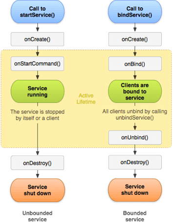

# Services

Service is an Android component that can perform long running operations in the background.

Services do not have User Interface.

A Service runs on a main thread of its hosting process. Services do not create its own thread or does not run in a
separate process unless we specify.

We should always run any blocking operation on a separate thread within the service to avoid ANR errors.

<br/>

**Types of Services:**

1. Foreground Service
2. Background Service
3. Bound Service

<br/>

### Thread & Processes:

Whenever the application starts, android system creates default process for an application and there is also a main
thread associate with it, in which all the android components are present.

Main Thread can only be used for small and lightweight operations.

> **Note:** From Android 8.0 (Oreo), Services has background execution limit to overcome this,
> we should use Work Manager.

<br/>

### Background Services:

A Background Service performs an operation that isn't directly noticed by users. For example, getting location of user
or in-app content updates like writing to storage.

> **Note:** If app targets API 26 or higher, system might kill services if app is not in the foreground.
> For example, accessing user location from the background, instead we should use WorkManager or Job Scheduler API.

<br/>

**Service can be registered in Android Manifest as follows:**

```xml

<service android:name=".ExampleService"/>
```

<br/>

### Started Service:

The Started Service can run in the background indefinitely even if the component that started it is destroyed.

Started Service can receive data from it's calling component via `Intent` but it cannot send data back to it's calling
component. When we're done with the job we should stop service manually.

Started Service can be started using the `startService()` method then it will call the service's
`onStartCommand()` method.

Started Service can be stopped by calling `stopSelf()` method call from the Service itself or we can stop by calling
`stopService()` method from calling component.

> **Note:** If service is running, and we call `startService()` method multiple times then it will
> only call `onStartCommand()` method.

```kotlin
class MyStartedService : Service() {

    private val TAG = MyStartedService::class.java.simpleName

    override fun onCreate() {
        super.onCreate()
        Log.wtf(TAG, "onCreate: ")
    }

    override fun onStartCommand(intent: Intent?, flags: Int, startId: Int): Int {
        Log.wtf(TAG, "onStartCommand: ")
        return super.onStartCommand(intent, flags, startId)
    }

    override fun onBind(intent: Intent?): IBinder? {
        return null // always return null in case of Started Service
    }

    override fun onDestroy() {
        Log.wtf(TAG, "onDestroy: ")
        super.onDestroy()
    }
}
```

We can Start or Stop Service from Activity as Follows:

```kotlin
class MainActivity : AppCompatActivity() {

    private lateinit var binding: ActivityMainBinding
    private val TAG = MainActivity::class.java.simpleName

    override fun onCreate(savedInstanceState: Bundle?) {
        super.onCreate(savedInstanceState)

        binding = ActivityMainBinding.inflate(layoutInflater)
        setContentView(binding.root)

        binding.btnStartService.setOnClickListener {
            Intent(this, MyStartedService::class.java).also { intent ->
                startService(intent) // Starting service
            }
        }

        binding.btnStopService.setOnClickListener {
            Intent(this, MyStartedService::class.java).also { intent ->
                stopService(intent) // Stopping service
            }
        }
    }
}
```

> **Note:** When we do not use Bound Service then we should return null from the `onBind()` method.

<br/>

**`onStartCommand()` return flags:**

1. START_NOT_STICKY:

   If Service is destroyed by system, it won't be strted again automatically and also the intent will be null

```kotlin
override fun onStartCommand(intent: Intent?, flags: Int, startId: Int): Int {
    return START_NOT_STICKY
}
```

2. START_STICKY:

   it will restart the Service but the `Intent` will be `null`.

```kotlin
override fun onStartCommand(intent: Intent?, flags: Int, startId: Int): Int {
    return START_STICKY
}
```

3. START_REDELIVER_INTENT:

   If system kills the Service, it will recreats the Service and Intent will be delivered will not be null. This is
   useful for the apps which uses download Service.

```kotlin
override fun onStartCommand(intent: Intent?, flags: Int, startId: Int): Int {
    return START_REDELIVER_INTENT
}
```

<br/>

### Intent Service:

Intent Service is the base class of Started Service, and it runs on a separate worker thread.

In this Service we need to override `onHandleIntent()` method. If we call this method multiple times, it will create
queue and all the tasks will be handle one at a time.

Intent Service stops itself when the work is done, we do not need to call `stopService()` or
`stopSelf()` method explicitly.

```kotlin
class MyIntentService : IntentService("MyIntentService") {

    private val TAG = MyIntentService::class.java.simpleName

    override fun onCreate() {
        super.onCreate()
        Log.wtf(TAG, "onCreate: ")
    }

    override fun onHandleIntent(intent: Intent?) {
        Thread.sleep(5000)
        Log.wtf(TAG, "onHandleIntent: ${Thread.currentThread().name}")
    }

    override fun onDestroy() {
        Log.wtf(TAG, "onDestroy: ")
        super.onDestroy()
    }
}
```

**Start Intent Service From Activity:**

```kotlin
binding.btnStartIntentService.setOnClickListener {
    Intent(this, MyIntentService::class.java).also { intent ->
        startService(intent)
    }
}
```

> Intent Service provides default implementation for the `onStartCommand()` and `onBind()` method. Therefore, it is not mandatory
> to override these methods.

> **Note:** Intent Service is deprecated from Android 11 and using this Service is not recommended for new apps as it will not work well starting with Android 8 (oreo),
> due to the background execution limit.

<br/>

### Communication between Activity & Service:

We can use the following approaches while communicating between Activity and Service using following ways:

1. Result receiver
2. Broadcast Receiver

<br/>

**Communication using Result Receiver:**

```kotlin
class MyIntentService : IntentService("MyIntentService") {

    private val TAG = MyIntentService::class.java.simpleName

    override fun onCreate() {
        super.onCreate()
        Log.wtf(TAG, "onCreate: ")
    }

    override fun onHandleIntent(intent: Intent?) {
        intent?.let {
            val receiver: ResultReceiver? = it.getParcelableExtra("receiver")
            val bundle = Bundle()
            bundle.putString("key", "Hello From Intent Service!")
            receiver?.send(100, bundle)
        }
    }

    override fun onDestroy() {
        Log.wtf(TAG, "onDestroy: ")
        super.onDestroy()
    }
}
```

```kotlin
class MainActivity : AppCompatActivity() {

    private lateinit var binding: ActivityMainBinding
    private val TAG = MainActivity::class.java.simpleName

    override fun onCreate(savedInstanceState: Bundle?) {
        super.onCreate(savedInstanceState)

        binding = ActivityMainBinding.inflate(layoutInflater)
        setContentView(binding.root)

        binding.btnStartIntentService.setOnClickListener {
            Intent(this, MyIntentService::class.java).also { intent ->
                intent.putExtra("receiver", MyResultReceiver(null))
                startService(intent) // Start Service
            }
        }
    }

    inner class MyResultReceiver(handler: Handler?) : ResultReceiver(handler) {
        override fun onReceiveResult(resultCode: Int, resultData: Bundle?) {
            super.onReceiveResult(resultCode, resultData)
            // here we receive result from Intent Service
            Log.wtf(TAG, "resultCode: $resultCode")
            Log.wtf(TAG, "resultData: ${resultData?.getString("key")}")
        }
    }
}
```

> **Note:** If we send result to ResultReceiver from background thread or IntentService, then it will receive the result in the background thread
> to access the UI element we need to user `Handler`


<br/>


**Communication using Broadcast Receiver:**

**_Intent Service Example_:**

```kotlin
class MyIntentService : IntentService("MyIntentService") {

    private val TAG = MyIntentService::class.java.simpleName

    override fun onCreate() {
        super.onCreate()
        Log.wtf(TAG, "onCreate: ")
    }

    override fun onHandleIntent(intent: Intent?) {
        Intent("my.custom.action").also { intent ->
            intent.putExtra("result", "some rersult from service")
            sendBroadcast(intent)
        }
    }

    override fun onDestroy() {
        Log.wtf(TAG, "onDestroy: ")
        super.onDestroy()
    }
}
```

```kotlin
class MainActivity : AppCompatActivity() {

    private lateinit var binding: ActivityMainBinding
    private val TAG = MainActivity::class.java.simpleName

    override fun onCreate(savedInstanceState: Bundle?) {
        super.onCreate(savedInstanceState)

        binding = ActivityMainBinding.inflate(layoutInflater)
        setContentView(binding.root)

        binding.btnStartIntentService.setOnClickListener {
            Intent(this, MyIntentService::class.java).also { intent ->
                startService(intent) // Start Service
            }
        }
    }

    override fun onResume() {
        super.onResume()
        // register broadcasr receiver
        IntentFilter("my.custom.action").also { intentFilter ->
            registerReceiver(myBroadcastReceiver, intentFilter)
        }
    }

    override fun onPause() {
        // un register receiver to avoid memoty leak
        unregisterReceiver(myBroadcastReceiver)
        super.onPause()
    }

    private val myBroadcastReceiver = object : BroadcastReceiver() {
        override fun onReceive(context: Context?, intent: Intent?) {
            Log.wtf(TAG, "onReceive: ${intent?.getStringExtra("result")}")
        }
    }
}
```

**_Started Service Example_:**

```kotlin
class MyStartedService : Service() {

    private val TAG = MyStartedService::class.java.simpleName

    override fun onCreate() {
        super.onCreate()
        Log.wtf(TAG, "onCreate: ")
    }

    override fun onStartCommand(intent: Intent?, flags: Int, startId: Int): Int {
        Intent("my.custom.action").also { intent ->
            intent.putExtra("result", "some rersult from started service")
            sendBroadcast(intent)
        }
        return START_NOT_STICKY
    }

    override fun onBind(p0: Intent?): IBinder? {
        return null // always return null in case of Started Service
    }

    override fun onDestroy() {
        Log.wtf(TAG, "onDestroy: ")
        super.onDestroy()
    }
}
```

```kotlin
class MainActivity : AppCompatActivity() {

    private lateinit var binding: ActivityMainBinding
    private val TAG = MainActivity::class.java.simpleName

    override fun onCreate(savedInstanceState: Bundle?) {
        super.onCreate(savedInstanceState)

        binding = ActivityMainBinding.inflate(layoutInflater)
        setContentView(binding.root)

        binding.btnStartService.setOnClickListener {
            Intent(this, MyStartedService::class.java).also { intent ->
                startService(intent)
            }
        }

        binding.btnStopService.setOnClickListener {
            Intent(this, MyStartedService::class.java).also { intent ->
                stopService(intent)
            }
        }
    }

    override fun onResume() {
        super.onResume()
        IntentFilter("my.custom.action").also { intentFilter ->
            registerReceiver(myBroadcastReceiver, intentFilter)
        }
    }

    override fun onPause() {
        unregisterReceiver(myBroadcastReceiver)
        super.onPause()
    }

    private val myBroadcastReceiver = object : BroadcastReceiver() {
        override fun onReceive(context: Context?, intent: Intent?) {
            Log.wtf(TAG, "onReceive: ${intent?.getStringExtra("result")}")
        }
    }
}
```

<br/>

### Bound Service:

A bound service used to allow android components to interact with Service like send and receive data.

A Bound Service runs only as long as application components attached to it. Multiple components can bind to service at
once but when all of them unbind, service is automatically gets destroyed.

Bound Service can be call from Activity, Service and Content Provider's except Broadcast Receiver.

We can bind to Service using `bindService()` and unbind using `unbindService()` methods.

In Bound Service, we can send and receive data using `ServiceConnection` class.

In case of Bound Service, we should never return `null` from the `onBind()` service method.

```kotlin
class MyBoundService : Service() {

    private val myLocalBinder by lazy { MyLocalBinder() }

    inner class MyLocalBinder : Binder() {

        fun getService(): MyBoundService {
            return this@MyBoundService // return instance of current class
        }
    }

    override fun onBind(intent: Intent?): IBinder {
        return myLocalBinder
    }

    fun someServiceMethod(): String {
        return "hello from service method"
    }
}
```

```kotlin
class MainActivity : AppCompatActivity() {

    private lateinit var binding: ActivityMainBinding
    private val TAG = MainActivity::class.java.simpleName
    private var isBind: Boolean = false
    private lateinit var myBoundService: MyBoundService

    override fun onCreate(savedInstanceState: Bundle?) {
        super.onCreate(savedInstanceState)

        binding = ActivityMainBinding.inflate(layoutInflater)
        setContentView(binding.root)

        binding.btnCommunicateBoundService.setOnClickListener {
            val serviceResult = myBoundService.someServiceMethod()
            Log.wtf(
                TAG,
                "onCreate: $serviceResult"
            ) // here we can call any service method and get result back
        }
    }

    override fun onStart() {
        super.onStart()
        Intent(this, MyBoundService::class.java).apply {
            bindService(this, serviceConnection, BIND_AUTO_CREATE) // here we bind service
        }
    }

    override fun onStop() {
        // if service is bind then only unbind else we will get error
        if (isBind) {
            unbindService(serviceConnection)
            isBind = false
        }
        super.onStop()
    }

    private val serviceConnection = object : ServiceConnection {
        override fun onServiceConnected(componentName: ComponentName?, iBinder: IBinder?) {
            Log.wtf(TAG, "onServiceConnected: ")
            isBind = true

            // get instance of MyLocalBinder class
            val myLocalBinder = iBinder as MyBoundService.MyLocalBinder

            // get instance of MyBoundService
            myBoundService = myLocalBinder.getService()
        }

        override fun onServiceDisconnected(componentName: ComponentName?) {
            Log.wtf(TAG, "onServiceDisconnected: ")
            isBind = false
        }

    }
}
```

<br/>

**Flags used while binding service:**

**1. BIND_AUTO_CREATE**:

Automatically creates the service as long as components attached to it.

**2. BIND_DEBUG_UNBIND**:

Creates debug information for unmatched bind/unbind calls.

**3. BIND_NOT_FOREGROUND**:

The Bound Service will never be brought to the foreground process level.

**4. 0**:

Can use this flag if we do not want to use other flags.

<br/>

**Started / Intent Service VS Bound Service:**

| Started / Intent Service                            | Bound Service                                                               |
|:----------------------------------------------------|-----------------------------------------------------------------------------|
| Just to accomplish task (may be long tasks)         | For long standing connection                                                |
| Invoked by `startService()`                         | Invoked by `bindService()`                                                  |
| `onBind()` returns `null`                           | `onBind()` returns `IBinder`                                                |
| Continue to run even calling component is destroyed | if the calling component is destroyed then Bound Servive also get Destroyed |

<br/>

> **Note:** Generally, we use `onStart()` and `onStop()` to bind and unbind service.
> If you want your activity to bind to the service even when it is not visible then we can bind and unbind
> in on `onCreate()` and `onDestroy()`.


<br/>

### Foreground Services:

A Foreground Service performs some operations that are noticeable to user. For Example, Music streaming app would use a
Foreground Service to play an audio track.

> **Note:** Foreground Services must display a notification.

Foreground Service continue running even when the user closes an app or user not interacting with the app.

When we use Foreground Service, we must display a notification that the service is running. The notification cannot be
dismissed unless the Service is either stopped or removed from the foreground.

Apps that target Android 9 (API level 28) or higher and use foreground services must request the `FOREGROUND_SERVICE`
permission.

```xml

<uses-permission android:name="android.permission.FOREGROUND_SERVICE"/>
```

```kotlin
class MyForegroundService : Service() {

    private val CHANNEL_ID = "ForegroundServiceChannel"

    override fun onStartCommand(intent: Intent?, flags: Int, startId: Int): Int {
        createNotificationChannel()

        // here we create notification and show that service is running
        val notificationIntent = Intent(this, MainActivity::class.java)
        val pendingIntent = PendingIntent.getActivity(
            this,
            0, notificationIntent, 0
        )
        val notification: Notification = NotificationCompat.Builder(this, CHANNEL_ID)
            .setContentTitle("Foreground Service")
            .setContentText("Hello From Foreground Service")
            .setContentIntent(pendingIntent)
            .build()
        startForeground(1, notification)

        return START_NOT_STICKY
    }


    override fun onBind(intent: Intent?): IBinder? {
        return null // this is started service, returning null
    }

    private fun createNotificationChannel() {
        if (Build.VERSION.SDK_INT >= Build.VERSION_CODES.O) {
            val serviceChannel = NotificationChannel(
                CHANNEL_ID,
                "Foreground Service Channel",
                NotificationManager.IMPORTANCE_DEFAULT
            )
            val manager = getSystemService(
                NotificationManager::class.java
            )
            manager.createNotificationChannel(serviceChannel)
        }
    }
}
```

```kotlin
class MainActivity : AppCompatActivity() {

    override fun onCreate(savedInstanceState: Bundle?) {
        super.onCreate(savedInstanceState)

        btnStartService.setOnClickListener {
            Intent(this, MyForegroundService::class.java).apply {
                ContextCompat.startForegroundService(this@MainActivity, this)
            }
        }

        btnStopService.setOnClickListener {
            Intent(this, MyForegroundService::class.java).apply {
                stopService(this)
            }
        }
    }
}
```

<br/>

### Service Lifecycle:



<br/>


### Enhancing App Security with Service:


   